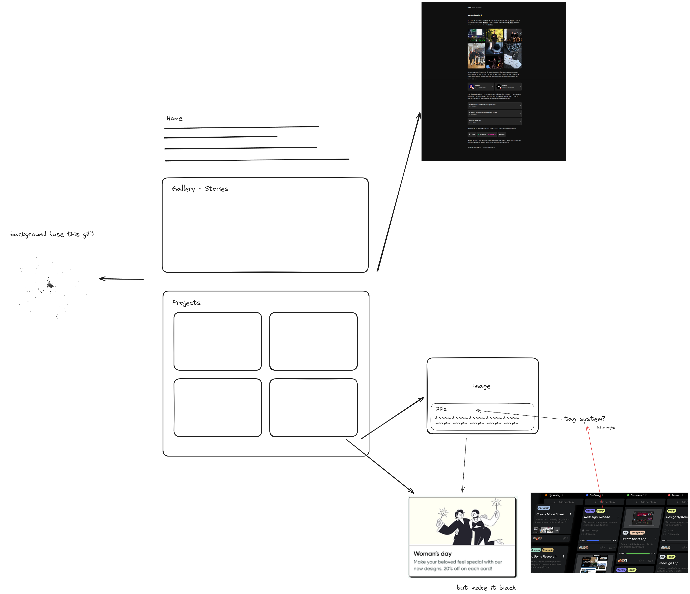

# Personal Web Portofolio

built with tailwind and react.

## The Design

- mainly adopted from [leerob.io](https://leerob.io/)
- few components are inspired from [dribble](https://dribbble.com/)

## Future Features/Improvement

- [x] fix bug on project card (mobile view)
- [ ] add spotlight effect [[source]](https://codepen.io/sebastian-piskaty/pen/xxaZYOL)
- [ ] add spotlight effect 2 [[source]](https://codepen.io/Hyperplexed/pen/KKBjvbG)
- [ ] spice up writings [[source]](https://codepen.io/Hyperplexed/pen/YzeOLYe)
- [ ] migrate react-grid-gallery to [[source]](https://react-photo-album.com/)
- [ ] migrate to next.js
- [ ] add blog
- [ ] add 'creative' side (unfinished)

## Updated future features

I planned to update my web portfolio so it will be more maintainable. the stacks are:
- notion (blog)
- super.site (host)
- framer.com (host, main website, personalized)
- next/svelte for first gateaway like carrd.co

try to design using human interface guidelines from apple.
with this stacks i don't need to worry about maintining it and it will def give high quality content and designs.